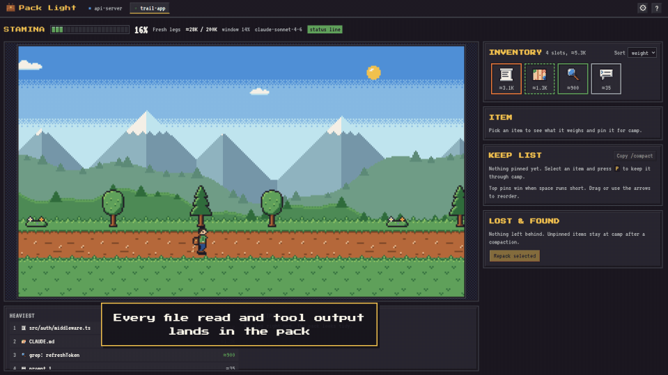
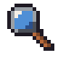
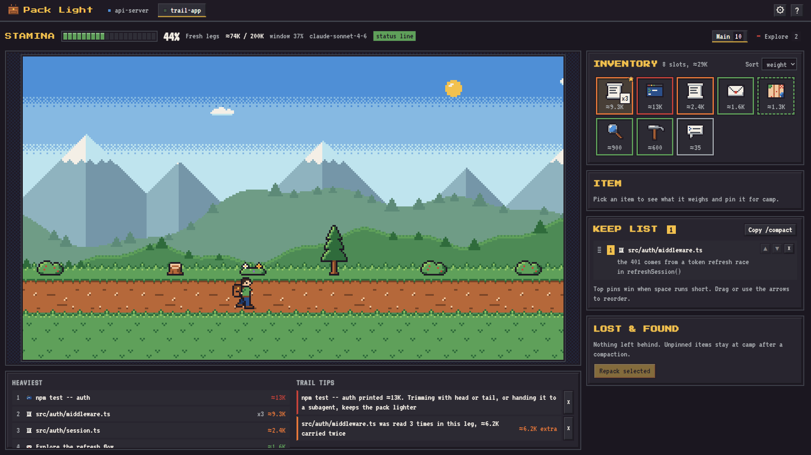
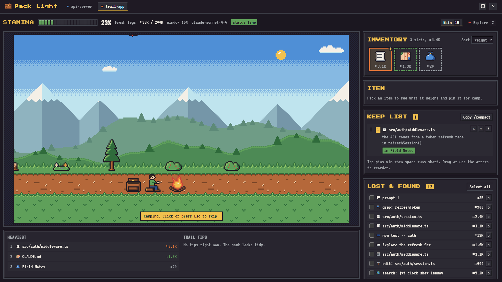
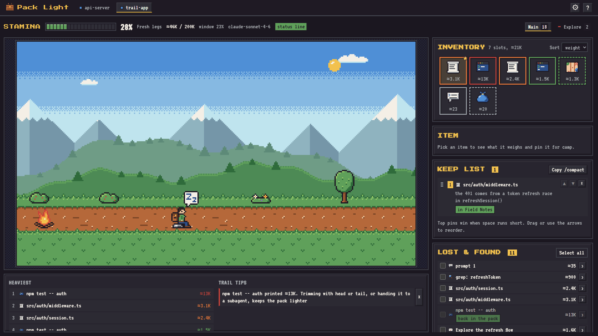
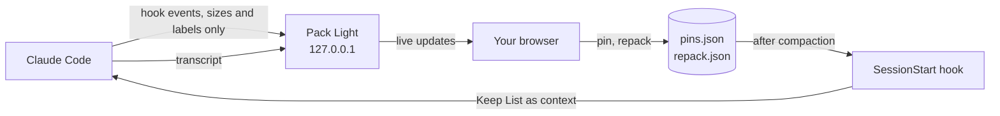

<p align="center"></p>

<h1 align="center">Pack Light</h1>

<p align="center"><b>See what fills your Claude Code context. Keep what matters through compaction.</b></p>

<p align="center">
  <a href="LICENSE"></a>
  
  
  
</p>

<p align="center"></p>

<p align="center">
  <a href="#quick-start">Quick start</a> ·
  <a href="#how-it-works">How it works</a> ·
  <a href="#install">Install</a> ·
  <a href="#using-pack-light">Using it</a> ·
  <a href="#faq">FAQ</a>
</p>

## Why

Long Claude Code sessions fill the context window with file reads, search results and command output. You can't see what is taking up the room, and when the window fills up Claude Code compacts the conversation into a summary. The one detail you needed, the bug you traced, the file that mattered, can quietly disappear.

Pack Light turns that invisible window into a hiker's backpack. Every item Claude picks up lands in the pack with its size. The fuller the context, the heavier the walk. Compaction is a campfire stop where unpinned items are left behind, and everything you pinned is put straight back into context by a hook, no matter what the summary kept.

## Features

<table>
  <tr>
    <td width="72" align="center"></td>
    <td><b>See what eats context.</b> A live inventory for every session with ≈token sizes, the heaviest items first, and repeat reads stacked as x2, x3.</td>
  </tr>
  <tr>
    <td align="center"></td>
    <td><b>Pin what must survive.</b> Add a note or keep an exact excerpt. After every compaction, manual or automatic, your Keep List goes back into context.</td>
  </tr>
  <tr>
    <td align="center"></td>
    <td><b>Watch compaction happen.</b> The hiker camps, unpinned items drop, and each pin shows whether the summary mentioned it.</td>
  </tr>
  <tr>
    <td align="center"></td>
    <td><b>Repack what was dropped.</b> Pick items from Lost and Found and they ride along with your next prompt, exactly once.</td>
  </tr>
  <tr>
    <td align="center"></td>
    <td><b>Trail tips.</b> Plain hints about a file read three times, one giant command output, stale loads, and camp coming up with nothing pinned.</td>
  </tr>
  <tr>
    <td align="center"></td>
    <td><b>Subagents as companions.</b> They walk behind the hiker with their own satchels and hand back a letter when they finish.</td>
  </tr>
</table>

Everything runs on your machine. Hooks never block Claude Code, and when the app is closed they do nothing at all.

## Quick start

You need Node 20 or newer and Claude Code.

```sh
npx pack-light install   # add the hooks, with a diff and a backup first
npx pack-light           # open the app
```

Then start a Claude Code session as usual and watch it show up as a tab. To look around before installing anything, run `npx pack-light demo`.

## Screenshots

<p align="center"></p>
<p align="center"><sub><b>On the trail.</b> The pack fills as Claude works, a file read three times stacks as x3, and trail tips point out the waste.</sub></p>

<p align="center"></p>
<p align="center"><sub><b>Camp.</b> Compaction happens, unpinned items fall into Lost and Found, and the pin survives, marked "in Field Notes".</sub></p>

<p align="center"></p>
<p align="center"><sub><b>After camp.</b> A dropped command output was repacked and rides along with the next prompt.</sub></p>

## How it works



1. Small hook scripts tell Pack Light what each tool call added, sending only a label and a size.
2. Pack Light also reads the session transcript for exact sizes, the model's context usage and compaction markers, and streams the state to your browser.
3. When you pin something, it is saved to a small file for that session.
4. Right after a compaction, Claude Code runs the `SessionStart` hook. It reads your pins straight from disk, so the app does not even need to be open, and adds them back to the fresh context as plain facts.

```
Context carried over from before compaction (pinned by the user in Pack Light):
- File src/auth/middleware.ts was read before compaction. User note: the 401 bug comes from a token refresh race in refreshSession().
These files can be re-read if their current contents are needed.
```

The Keep List order decides what gets cut if your pins would pass 9,000 characters. See [docs/ARCHITECTURE.md](docs/ARCHITECTURE.md) for the full picture.

## Install

### From npm

```sh
npx pack-light install
```

This shows a diff of the hooks it will add to `~/.claude/settings.json`, backs the file up, and asks before writing.

### From source

```sh
git clone https://github.com/Msde-7/pack-light.git
cd pack-light
npm install
npm run build
npm link            # puts the packlight command on your PATH
packlight install
```

### Options

| Option         | What it does                                                                                                             |
| -------------- | ------------------------------------------------------------------------------------------------------------------------ |
| `--project`    | Adds the hooks to `.claude/settings.json` in the current folder instead of your user settings                            |
| `--statusline` | Feeds the app the exact context numbers from Claude Code's status line. An existing status line is wrapped, not replaced |
| `--yes`        | Skips the confirmation                                                                                                   |

Run `npx pack-light doctor` afterwards to check that everything is wired up.

## Using Pack Light

1. **Start the app** with `npx pack-light`. It opens in your browser.
2. **Work in Claude Code as usual.** Each session gets a tab, and sessions from the last hour are picked up too.
3. **Pin what matters.** Click an item, press **Pin** or `P`, and add a note. For file reads you can keep an excerpt of the exact lines.
4. **Let it compact.** Manually with `/compact` or on its own, the hiker camps and your pins go back into context.
5. **Repack if needed.** Select dropped items in Lost and Found and press **Repack selected**. They go in with your next prompt.

Planning a manual compaction? **Copy /compact** builds a `/compact Preserve ...` command from your pins that also steers the summary.

Prefer the terminal? `npx pack-light status` prints each active session's fill, heaviest items and pin count.

## Commands

Installed from npm? Type `npx pack-light` wherever this table says `packlight`. The hint messages already match whichever one you ran.

| Command                                                 | What it does                                                   |
| ------------------------------------------------------- | -------------------------------------------------------------- |
| `packlight` or `packlight start [--port N] [--no-open]` | Starts the app on 127.0.0.1                                    |
| `packlight install [--project] [--statusline] [--yes]`  | Adds the hooks, backs up the settings file first               |
| `packlight uninstall [--yes]`                           | Removes exactly what install added                             |
| `packlight doctor`                                      | Checks Node, hooks, the app, transcripts and the pins folder   |
| `packlight status`                                      | Prints fill, the heaviest items and pin counts in the terminal |
| `packlight demo [--loop] [--speed N]`                   | Plays a made-up session on an isolated server                  |
| `packlight pins list` or `clear [--session ID]`         | Shows or clears pins                                           |

## Privacy

- **Local only.** The app binds to 127.0.0.1, needs a random token on every call, and makes no outbound requests. Fonts and art are bundled.
- **Sizes, not content.** Hooks send labels and sizes, never tool output, prompt text or summaries.
- **Nothing copied to disk.** Pins keep only the label, path, note and the excerpt you chose.
- **Bare mode** in settings hides paths, commands and notes for screenshots and streams.

## Uninstall

```sh
npx pack-light uninstall
```

This removes only the entries install added and restores a wrapped status line. Your settings file is backed up in `~/.pack-light/backups` first. Delete `~/.pack-light` to remove pins and backups too.

## FAQ

**Does it slow Claude Code down?** Almost every hook runs in the background. The two that Claude Code waits for, on each prompt and right after compaction, read one small file and exit in about 0.1 to 0.15 s.

**Why are sizes marked ≈?** Item sizes are estimates at about four characters per token. The total context size is exact, taken from the status line or the transcript's usage records.

**Why does stamina reach 100% before the window is full?** Stamina counts toward the point where auto compaction starts, the window minus Claude Code's 33K buffer. The raw window share is shown next to it.

**Can it steer the summary automatically?** Not today. Claude Code's PreCompact hook can only block compaction, so Pack Light never uses it that way. Putting pins back after compaction is the guarantee, and Copy /compact covers manual runs.

**Does it work with subagents?** Yes. Each subagent appears as a companion with its own satchel, and its report shows up in the pack when it hands it back.

## Limitations

- Item sizes are estimates. MCP tools and a few rarer tools are sized from their result text.
- A subagent's satchel shows what it did through hook events. Its own context size comes from its transcript.
- Developed on Windows 11 with Claude Code 2.1.284. macOS and Linux use the same code paths.

## Development

```sh
npm install
npm run check      # typecheck, lint, format, dead code, tests
npm run build
npm run gallery    # every sprite at 6x
node dist/cli.js demo
```

## License

Code is MIT. The pixel art is original and dedicated to the public domain under CC0. The bundled fonts VT323 and Press Start 2P are under the SIL Open Font License.
